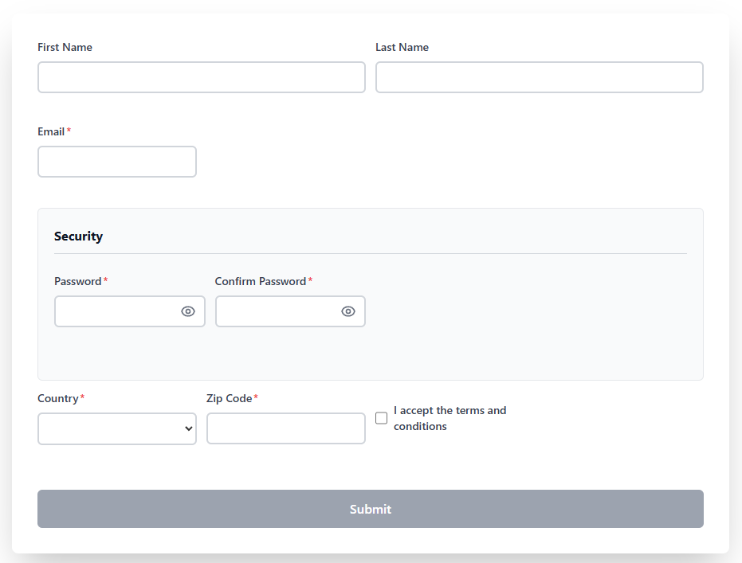

# ZodsForm 🚀

**TypeScript library to create dynamic forms with automatic validation using Zod and Tailwind CSS**

ZodsForm allows you to create complete HTML forms from Zod schemas or JSON structures, with real-time validation, Tailwind CSS styling, and a simple, intuitive API.



## ✨ Features

- 🎯 **Auto-generation from Zod**: Convert Zod schemas into functional forms
- ✅ **Real-time validation**: Validation while user types and on blur
- 🎨 **Tailwind CSS v4 integrated**: Modern and responsive styles
- 🔄 **Nested field support**: Objects and complex structures with dot-notation
- 📦 **Native TypeScript**: Full typing and autocomplete
- 🎭 **Input masks**: Automatic formatting (phone, credit card, ZIP, etc.) with string or regex
- 🔐 **Password fields**: With automatic show/hide toggle
- 🎨 **Custom components**: 3-level system (global, instance, field)
- 🎛️ **Dynamic properties**: Change visibility, size, options in real-time
- 🌐 **Multiple input types**: text, number, email, password, textarea, select, checkbox
- 🎯 **Auto-mounting**: Specify the element where the form will be mounted
- 🔍 **Cross-field validation**: Support for Zod's `.refine()` (e.g., confirm password)

## 📦 Installation

```bash
npm install zodsform zod
```

Or with yarn:

```bash
yarn add zodsform zod
```

**Note**: CSS styles are included in the package. Just import them:

```typescript
import 'zodsform/dist/styles.css'
```

## 🚀 Quick Start

### 1. From a Zod Schema with Extensions (Recommended)

```typescript
import { z } from "zod";
import { ZodsForm } from "zodsform";
import "zodsform/dist/styles.css";

// Define your Zod schema with ZodsForm extensions
const userSchema = z.object({
  firstName: z.string()
    .min(2, "Minimum 2 characters")
    .label("First Name")                  // 🏷️ Custom label
    .properties({ size: 6 }),             // 📏 Grid size (1-12)
  
  lastName: z.string()
    .min(2, "Minimum 2 characters")
    .label("Last Name")
    .properties({ size: 6 }),
  
  email: z.string()
    .email("Invalid email")
    .label("Email Address"),
  
  age: z.number()
    .min(18, "Must be 18 or older")
    .label("Age")
    .properties({ visible: false }),      // 👁️ Hidden by default
});

// Create the form automatically with element selector
const form = ZodsForm.fromSchema(userSchema, {
  el: "#root", // CSS selector or DOM element where it will be mounted
  onSubmit: (data) => {
    console.log("Validated data:", data);
    // Send to your API
  },
  onChange: (data, errors) => {
    console.log("Current data:", data);
    console.log("Errors:", errors);
  },
  onValidate: (isValid, data, errors) => {
    console.log("Form valid:", isValid);
  }
});

// Automatically mounted on the specified element
form.render();

// Or you can mount it manually without specifying 'el':
// document.getElementById("root")?.appendChild(form.render());
```

### 2. With Input Masks

```typescript
const contactSchema = z.object({
  phone: z.string()
    .length(10, "Phone must have 10 digits")
    .label("Phone")
    .properties({ mask: "###-###-####" }),  // 📞 Format mask
  
  zipCode: z.string()
    .length(5, "Invalid ZIP code")
    .label("ZIP Code")
    .properties({ mask: "#####" }),
  
  creditCard: z.string()
    .length(16, "Invalid card")
    .label("Credit Card")
    .properties({ mask: "####-####-####-####" }),
  
  customMask: z.string()
    .label("Only numbers 1-6")
    .properties({ mask: /^[1-6]\d{0,5}$/ }),  // 🎭 Regex mask
});
```

### 3. With Password Fields

```typescript
const securitySchema = z.object({
  security: z.object({
    password: z.string()
      .min(8, "Minimum 8 characters")
      .label("Password")
      .password(),  // 🔐 Automatic show/hide toggle
    
    confirmPassword: z.string()
      .label("Confirm Password")
      .password(),
  }).label("Security"),
})
.refine((data) => data.security.password === data.security.confirmPassword, {
  message: "Passwords do not match",
  path: ["security.confirmPassword"],  // ✅ Cross-field validation
});
```

## 📚 Zod Extensions

ZodsForm extends Zod with chainable methods to configure fields:

| Method | Description | Example |
|--------|-------------|---------|
| `.label(string)` | Defines the label text | `z.string().label("Full Name")` |
| `.properties({...})` | Configures field properties | `z.string().properties({ size: 6, mask: "###-####" })` |
| `.password(boolean)` | Converts to password field with toggle | `z.string().password()` |
| `.component(ComponentConfig)` | Assigns a custom component | `z.boolean().component(ToggleSwitch)` |

### Available Properties

```typescript
.properties({
  size?: number;           // Grid size (1-12 columns)
  visible?: boolean;       // Show/hide field
  disabled?: boolean;      // Enable/disable
  placeholder?: string;    // Placeholder text
  mask?: string | RegExp;  // Input mask
  // For select:
  options?: Array<{
    value: string | number;
    label: string;
  }>;
})
```

## 📚 Supported Field Types

| Type | Description | Zod Example |
|------|-------------|-------------|
| `text` | Text input | `z.string()` |
| `number` | Numeric input | `z.number()` |
| `email` | Email input | `z.string().email()` |
| `password` | Password input with toggle | `z.string().password()` |
| `textarea` | Text area | `z.string()` (long) |
| `select` | Dropdown selector | `z.enum(["a", "b"])` or `z.enum({ a: "A", b: "B" })` |
| `checkbox` | Checkbox | `z.boolean()` |
| `section` | Visual container | - |
| `box` | Bordered container | `z.object({...}).label("Title")` |

## 🔥 Advanced Examples

### Form with Nested Objects

```typescript
const addressSchema = z.object({
  user: z.object({
    name: z.string().label("Name"),
    email: z.string().email().label("Email"),
  }).label("User"),  // 📦 Box with title
  
  address: z.object({
    street: z.string().label("Street"),
    city: z.string().label("City"),
    zipCode: z.string()
      .length(5)
      .label("ZIP Code")
      .properties({ mask: "#####" }),
  }).label("Address"),  // 📦 Another box
});

const form = ZodsForm.fromSchema(addressSchema, {
  onSubmit: (data) => {
    console.log(data);
    // {
    //   user: { name: "...", email: "..." },
    //   address: { street: "...", city: "...", zipCode: "12345" }
    // }
  },
});
```

### Form with Select (Enum)

```typescript
// Simple enum (uses values as labels)
const simpleEnum = z.object({
  role: z.enum(["admin", "user", "guest"]).label("Role"),
});

// Enum with custom labels (recommended)
const customEnum = z.object({
  country: z.enum({
    mx: "Mexico",
    us: "United States",
    es: "Spain",
    ar: "Argentina"
  }).label("Country"),
});

const form = ZodsForm.fromSchema(customEnum);
```

### Form with Custom Validations

```typescript
const schema = z.object({
  username: z
    .string()
    .min(3, "Minimum 3 characters")
    .max(20, "Maximum 20 characters")
    .regex(/^[a-zA-Z0-9_]+$/, "Only letters, numbers and underscore"),
  
  age: z
    .number()
    .min(18, "Must be 18 or older")
    .max(100, "Invalid age"),
  
  website: z
    .string()
    .url("Invalid URL")
    .optional(),
});
```

## 🎛️ API

### `ZodsForm.fromSchema(schema, config)`

Creates a form from a Zod schema.

**Parameters:**
- `schema`: Zod schema (ZodObject)
- `config`:
  - `el?`: CSS selector (string) or DOM element where to mount the form
  - `onValidate?`: Callback when the form is validated
  - `onSubmit?`: Callback when the form is submitted
  - `onChange?`: Callback on each field change
  - `components?`: Custom components map

**Returns:** ZodsForm instance

**Example:**
```typescript
const form = ZodsForm.fromSchema(mySchema, {
  el: "#app", // Automatically mounted on this element
  onSubmit: (data) => console.log(data),
});
form.render();
```

### `new ZodsForm(config, el?)`

Creates a form from a JSON structure.

**Parameters:**
- `config.structure`: Form structure
- `config.schema?`: Optional Zod schema for full validation
- `config.onSubmit?`: Submit callback
- `config.onChange?`: Change callback
- `config.onValidate?`: Validate callback
- `config.components?`: Custom components map
- `el?`: CSS selector or DOM element (optional)

### Instance Methods

#### `form.render(): HTMLElement`
Renders the form and returns the DOM element.

#### `form.getData(): any`
Gets the current form data.

#### `form.getErrors(): any`
Gets the current validation errors.

#### `form.setData(data: Record<string, any>): void`
Sets values in the form programmatically.

```typescript
form.setData({
  firstName: "John",
  email: "john@example.com",
  age: 25,
});
```

#### `form.setFieldProperty(fieldPath, property, value): void`
Dynamically changes any field property in the form in real-time. **Supports nested fields with dot-notation**.

```typescript
// Hide/show fields
form.setFieldProperty("companyName", "visible", false);
form.setFieldProperty("address.street", "visible", true);  // ✅ Nested fields

// Change grid size (1-12 columns)
form.setFieldProperty("email", "size", 12);

// Enable/disable fields
form.setFieldProperty("zipCode", "disabled", true);

// Update select options
form.setFieldProperty("country", "options", [
  { value: "mx", label: "Mexico" },
  { value: "us", label: "USA" }
]);

// Change min/max limits
form.setFieldProperty("age", "min", 18);

// Apply custom CSS classes
form.setFieldProperty("email", "className", "bg-yellow-100");

// Change masks (string or regex)
form.setFieldProperty("phone", "mask", "###-###-####");
```

**Supported properties**: `visible`, `size`, `disabled`, `className`, `min`, `max`, `options`, `mask`

## 🎭 Mask System

ZodsForm supports two types of masks for data input:

### 1. Format Masks (String)

Apply automatic formatting while the user types. The `#` symbol represents a digit:

```typescript
const maskedSchema = z.object({
  phone: z.string().properties({ mask: "###-###-####" }),      // 555-123-4567
  zipCode: z.string().properties({ mask: "#####" }),            // 12345
  creditCard: z.string().properties({ mask: "####-####-####-####" }), // 1234-5678-9012-3456
});
```

**Important**: The value is stored WITHOUT formatting (digits only), but displayed formatted in the input.

### 2. Validation Masks (RegExp)

Validate each character in real-time according to a regular expression:

```typescript
const regexMaskSchema = z.object({
  customCode: z.string().properties({ 
    mask: /^[1-6]\d{0,5}$/  // Only numbers 1-6, maximum 6 digits
  }),
  alphanumeric: z.string().properties({
    mask: /^[a-zA-Z0-9]*$/  // Only letters and numbers
  }),
});
```

## 🔧 Grid System

ZodsForm uses a 12-column grid system based on CSS Grid. Use the `size` property to control width:

```typescript
const gridSchema = z.object({
  firstName: z.string()
    .label("First Name")
    .properties({ size: 6 }),  // 50% width (6/12)
  
  lastName: z.string()
    .label("Last Name")
    .properties({ size: 6 }),  // 50% width (6/12)
  
  email: z.string()
    .label("Email")
    .properties({ size: 12 }), // 100% width (12/12)
});
```

**Common sizes**:
- `size: 3` → 25% (3/12)
- `size: 4` → 33% (4/12)
- `size: 6` → 50% (6/12)
- `size: 8` → 66% (8/12)
- `size: 12` → 100% (12/12) - default for boxes and textareas

## 🎨 Custom Components

ZodsForm allows you to completely customize the appearance of your forms with **three levels of customization** in priority order:

### 1. Field-level Components (Zod) - Highest Priority

```typescript
const schema = z.object({
  notifications: z.boolean()
    .label("Notifications")
    .component(ToggleSwitch),  // 🎯 Only this field uses ToggleSwitch
});
```

### 2. Instance-level Components

```typescript
const form = ZodsForm.fromSchema(schema, {
  components: {
    boolean: MyCustomToggle,      // By type
    acceptTerms: StyledCheckbox,  // By field name
  },
  onSubmit: (data) => console.log(data)
});
```

### 3. Global Components

```typescript
import { ZodsForm } from "zodsform";

// In your main.ts or index.ts
ZodsForm.registerComponents({
  boolean: ToggleSwitch,  // All booleans use toggle
});
```

### Creating Custom Components

```typescript
import type { ComponentConfig } from "zodsform";

export const ToggleSwitch: ComponentConfig = {
  render: (config) => {
    const wrapper = document.createElement('div');
    const input = document.createElement('input');
    input.type = 'checkbox';
    input.name = config.fieldPath;
    // ... your custom UI logic
    wrapper.appendChild(input);
    return wrapper;
  },
  getValue: (element) => {
    return element.querySelector('input')?.checked || false;
  },
  setValue: (element, value) => {
    const input = element.querySelector('input');
    if (input) input.checked = Boolean(value);
  }
};
```

## 🤝 Contributing

Contributions are welcome! Please:

1. Fork the project
2. Create a feature branch (`git checkout -b feature/AmazingFeature`)
3. Commit your changes (`git commit -m 'Add some AmazingFeature'`)
4. Push to the branch (`git push origin feature/AmazingFeature`)
5. Open a Pull Request

## 🔄 Migration from v0.1.x

If you were using previous versions, here are the main changes:

- ✅ **Nested fields fixed**: Validation of fields within objects now works correctly
- ✅ **Improved masks**: Support for regex in addition to string patterns
- ✅ **Improved components**: Clearer 3-level priority system
- ⚠️ **Removed methods**: `labels` in config no longer exists, use `.label()` in schema

## 📖 Additional Documentation

- **[QUICKSTART.md](./QUICKSTART.md)**: 5-minute quick guide
- **[CHANGELOG.md](./CHANGELOG.md)**: Change history
- **Demos**: See `src/demos.html` for interactive examples

## 👤 Author

**Dinnger**

- GitHub: [@dinnger](https://github.com/dinnger)
- NPM: [zodsform](https://www.npmjs.com/package/zodsform)

## 🙏 Acknowledgments

- [Zod](https://github.com/colinhacks/zod) - TypeScript-first validation library
- [Tailwind CSS](https://tailwindcss.com/) - Utility-first CSS framework
- The TypeScript community

## 📝 License

ISC License - see the [LICENSE](./LICENSE) file for more details

---

Made with ❤️ by Dinnger
